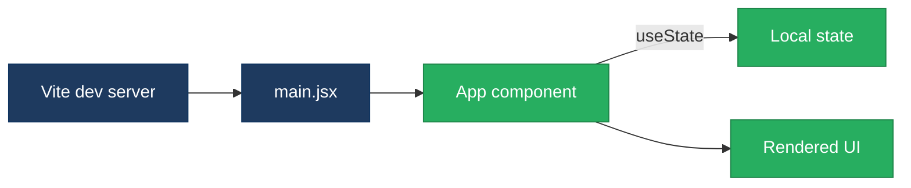
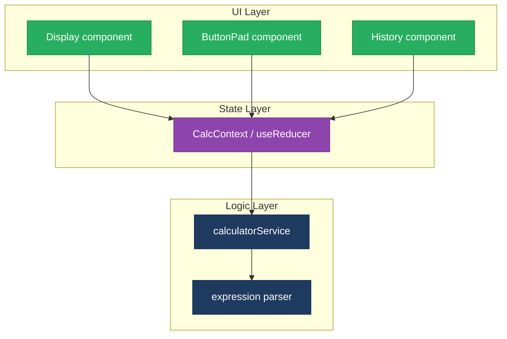
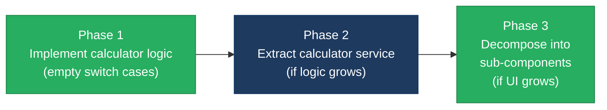

# 1. Architecture & Design Hotspots Analysis

**Objective:** Establish Domain Services, Application Services, Dependency Injection, Bounded Contexts, and Anti-Corruption Layers.

**Date:** 2026-08-18 16:26:49 IST | **Scope:** `shende-shweta/react-calculator` — React 18 SPA (Vite + SCSS), frontend-only, no backend layer

## Executive Summary

> **Executive Summary**
>
> The react-calculator repository is a minimal frontend-only Single Page Application built with React 18, Vite, and SCSS. The entire codebase consists of 2 JSX source files (88 total lines), 2 style files (100 total lines), and standard Vite configuration. There is **no backend layer** — no server-side code, no API endpoints, no database access, and no server-side routing. Because the standard architecture & design hotspots (H1–H9) target backend patterns (controllers, service layers, repositories, domain boundaries), they do not apply to this frontend-only repository. No additional architecture hotspots were observed: the codebase is small enough that its single-component structure is appropriate for the application's scope. Frontend-specific modernization concerns (component decomposition, state management patterns, etc.) are covered by the Frontend Modernization report (03-frontend-modernization).

<div class="metric-grid">
<div class="metric-card"><div class="metric-number">1</div><div class="metric-label">Components</div></div>
<div class="metric-card"><div class="metric-number">1</div><div class="metric-label">Hooks Used (useState)</div></div>
<div class="metric-card"><div class="metric-number">0</div><div class="metric-label">Stores / Contexts</div></div>
<div class="metric-card"><div class="metric-number">0</div><div class="metric-label">Frontend Service / API Modules</div></div>
</div>

<div class="overall-rating overall-rating--good"><div class="overall-rating-label">Overall Codebase Rating — Architecture &amp; Design</div><div class="overall-rating-value">Good</div><div class="overall-rating-note">No backend layer detected — backend hotspots H1–H9 not applicable. No additional architecture hotspots observed in this 88-line frontend-only SPA.</div></div>

## 1.1 Benchmark Ratings Summary

**No backend layer detected — backend hotspots H1–H9 not applicable.**

The repository contains only frontend code (React 18 SPA). The standard architecture & design hotspots (Fat Controllers, Missing Service Layer, Missing Repository Pattern, Circular Dependencies, Shared Utility Abuse, Direct SQL in Controllers, God Classes, Domain Boundary Violations, Shared Database Coupling) all target backend/server-side patterns and do not apply.

**No additional hotspots beyond the standard set were observed.**

The codebase is a 2-file, 88-LOC React application with a single component (`App.jsx`, 78 lines) and a standard entry point (`main.jsx`, 10 lines). At this scale, the absence of component decomposition, a service layer, or state management abstraction is architecturally appropriate — introducing these patterns would be over-engineering. The single `useState` hook and flat component tree reflect the minimal scope of a calculator widget.

**Frontend architecture concerns** (component decomposition, state management patterns, shared vs. local state, component size) **are covered by the Frontend Modernization report** (03-frontend-modernization) per the discovery workflow's category ownership.

## 1.2 Hotspot-by-Hotspot Evidence

No hotspots in this category have evidence — the backend layer required for H1–H9 does not exist, and no additional (H10+) architecture hotspots were observed.

## 1.3 Diagrams

### Current-state architecture (as-is)

```mermaid
flowchart TD
  A["index.html"] --> B["main.jsx<br/>React entry point (10 LOC)"]
  B --> C["App.jsx<br/>Single component (78 LOC)"]
  C --> D["useState hook<br/>result state"]
  C --> E["handleClick<br/>event handler (switch/case)"]
  C --> F["JSX render<br/>button grid + display"]
  C --> G["App.scss<br/>component styles (74 LOC)"]
  B --> H["index.css<br/>global styles (26 LOC)"]
  classDef entry fill:#1e3a5f,stroke:#0f3460,color:#fff
  classDef component fill:#27ae60,stroke:#1e8449,color:#fff
  classDef detail fill:#2c3e50,stroke:#1a252f,color:#fff
  classDef style fill:#8e44ad,stroke:#6c3483,color:#fff
  class A,B entry
  class C component
  class D,E,F detail
  class G,H style
```

### Clean reference path (current codebase — already minimal)

The current architecture is itself the clean reference for a project of this size. A single component with one state hook is the simplest valid React pattern:



### Domain boundary map

Not observed — this is a single-domain, single-component frontend application with no cross-domain data coupling. Skip this diagram.

### Target architecture (proposed — if the app grows)

If the calculator were to grow (history, themes, scientific mode, API-backed computation), the target architecture would introduce component decomposition and a thin service layer:



### Component-data flow (frontend-specific replacement for request flow)


### Improvement roadmap

No critical or moderate architecture improvements are required. The roadmap below addresses growth readiness only — none of these are blocking issues today:



## 1.4 Actions Required

No architecture & design hotspots require action. All standard hotspots (H1–H9) are not applicable to this frontend-only repository, and no additional hotspots were observed.

## 1.5 Expected Outcomes

- **Current state is architecturally sound** for the application's minimal scope — a single React component with local state is the correct pattern for a small calculator widget.
- **No refactoring needed today** — the codebase is small enough that additional abstraction layers (services, contexts, component decomposition) would add complexity without benefit.
- **Growth-ready path is clear** — if features expand (history, themes, scientific mode), the target architecture (component decomposition + service extraction + context-based state) is straightforward to adopt incrementally.
- **No backend coupling risks** — the application has no server-side dependencies, no API integrations, and no database access, eliminating an entire class of architectural concerns.
- **Frontend-specific concerns** (component size thresholds, state management patterns, style architecture) are tracked in the Frontend Modernization report (03-frontend-modernization) per the discovery workflow's category ownership.
