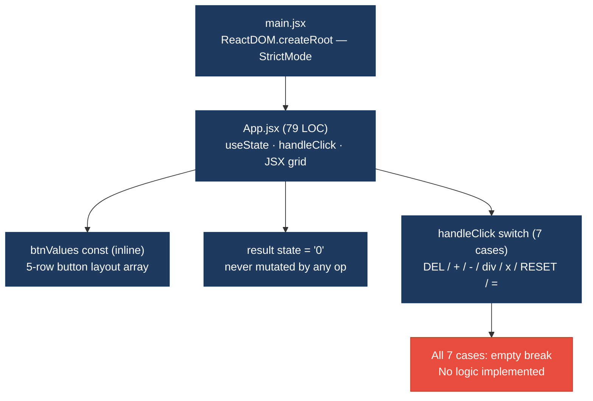
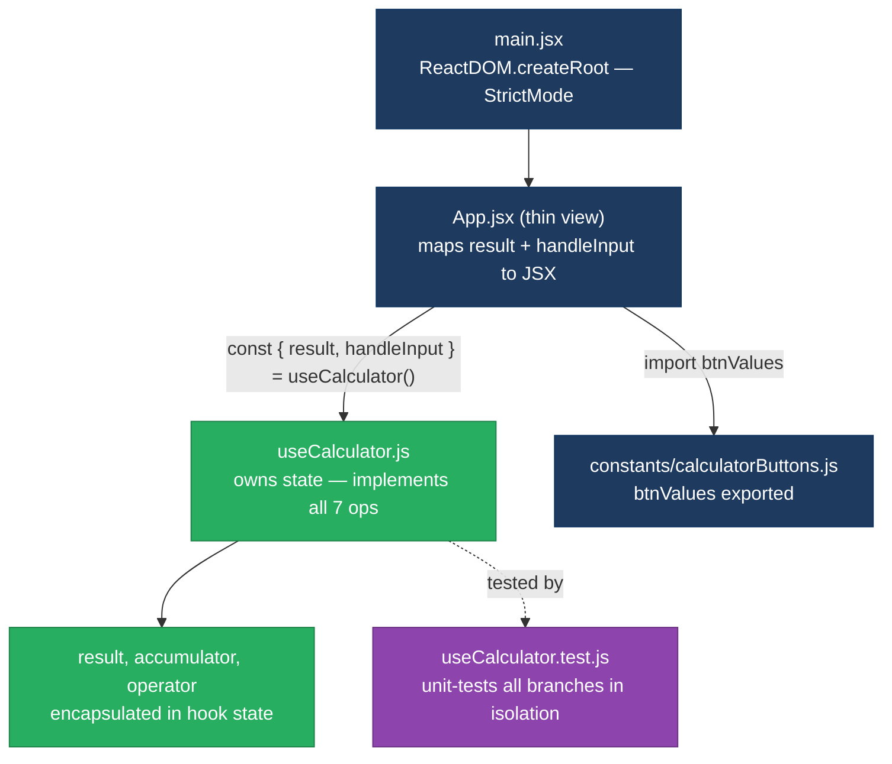
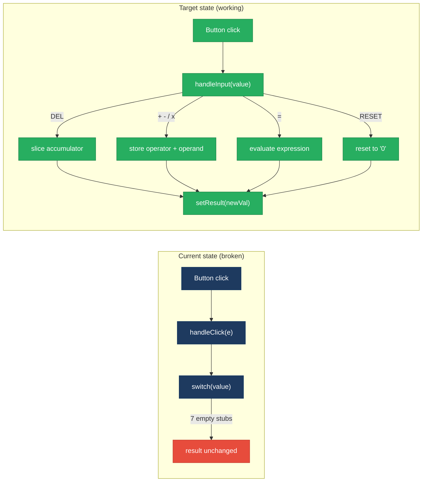
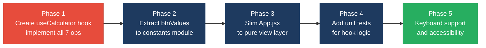

# 1. Architecture & Design Hotspots Analysis

**Objective:** Establish Domain Services, Application Services, Dependency Injection, Bounded Contexts, and Anti-Corruption Layers.

**Date:** 2026-08-27 13:13:45 IST | **Scope:** `.` — React 18.2 / Vite 4.0 / SCSS (frontend-only SPA)

**Repository:** `shende-shweta/react-calculator` | **Branch:** `main`

## Executive Summary

> **Executive Summary**
>
> The `react-calculator` repository is a minimal frontend-only React 18 SPA: 2 JSX files, 1 presentational component (`App.jsx`, 79 LOC), and no backend layer of any kind. The standard frontend hotspots F1–F5 are all clean — the single component is well within size thresholds, uses modern functional patterns with hooks, has no prop drilling, and makes zero inline API calls. The single significant architectural finding (H10) is that all 7 calculator business operations (`DEL`, `+`, `-`, `/`, `x`, `RESET`, `=`) are completely unimplemented empty stubs inside the component's switch handler, and no custom hook or utility module has been created to own the calculation logic. This leaves the app non-functional: no arithmetic operation produces any result. The dominant risk is **incomplete feature implementation with no separation of concerns** — the component acts as both UI shell and intended-but-absent logic owner, making the codebase structurally fragile for any future contributor who needs to add or test calculator behaviour.

<div class="metric-grid">
<div class="metric-card"><div class="metric-number">1</div><div class="metric-label">React Components</div></div>
<div class="metric-card"><div class="metric-number">0</div><div class="metric-label">Custom Hooks</div></div>
<div class="metric-card"><div class="metric-number">0</div><div class="metric-label">Service / Utility Modules</div></div>
<div class="metric-card"><div class="metric-number">7</div><div class="metric-label">Unimplemented Operations</div></div>
</div>

<div class="overall-rating overall-rating--high-risk"><div class="overall-rating-label">Overall Codebase Rating — Architecture &amp; Design</div><div class="overall-rating-value">High Risk</div><div class="overall-rating-note">Driven by H10 — all 7 calculator operations are empty stubs with no logic implemented anywhere in the codebase.</div></div>

## 1.1 Benchmark Ratings Summary

No backend layer detected — backend hotspots H1–H9 not applicable.

| # | Hotspot | Primary KPI | <span class="rating rating-good">Good</span> | <span class="rating rating-moderate">Moderate</span> | <span class="rating rating-high-risk">High Risk</span> | Measured | Rating |
|---|---|---|---|---|---|---|---|
| F1 | Business Logic in Components | Avg LOC per component | <150 | 150–300 | >300 | 79 LOC (1 component) | <span class="rating rating-good">Good</span> |
| F2 | Missing Frontend Service/Data Layer | Components with inline API/data calls | <10 | 10–20 | >20 | 0 | <span class="rating rating-good">Good</span> |
| F3 | God / Oversized Components | Components >400 LOC | 0 | 1–3 | >3 | 0 | <span class="rating rating-good">Good</span> |
| F4 | Prop Drilling / Global State Abuse | Max prop-drilling depth | ≤2 levels | 3–4 levels | >4 levels | 0 levels (single component) | <span class="rating rating-good">Good</span> |
| F5 | Legacy / Inconsistent Component Patterns | Legacy/deprecated-pattern components | 0 | 1–10 | >10 | 0 | <span class="rating rating-good">Good</span> |
| H10 | Missing Calculator Logic Abstraction (additional) | Operations implemented outside component (target: 100% in hook/utility) | 100% | 50–99% | <50% | 0% — 7/7 operations are empty stubs | <span class="rating rating-high-risk">High Risk</span> |

No additional hotspots beyond H10 were observed.

## 1.2 Hotspot-by-Hotspot Evidence

### H10. Missing Calculator Logic Abstraction <span class="sev sev-critical">Critical</span>

**Benchmark:** `Operations implemented outside component = 0%` → falls in the **High Risk** band (Good ≥100% · Moderate 50–99% · High Risk <50%).

**What to check:** Whether calculator state management and arithmetic operations (DEL, +, -, /, x, RESET, =) are separated from the presentation component into a dedicated custom hook (`useCalculator`) or utility module, rather than being stubbed or inlined in `App.jsx`.

**Evidence:**

`src/App.jsx:16–51` — the sole event handler `handleClick` contains a switch statement with 7 cases; every case body is empty (`break` only):

```jsx
const handleClick = (e) => {
  const value = e.target.getAttribute("value")

  switch (value) {
    case "DEL":

      break;

    case "+":

      break;

    case "-":

      break;

    case "/":

      break;

    case "x":

      break;

    case "RESET":

      break;

    case "=":

      break;

    default:
      break;
  }
}
```

All 7 operations (`DEL`, `+`, `-`, `/`, `x`, `RESET`, `=`) are stubs — pressing any button produces no state change. The `result` state (line 14) is initialised to `"0"` and never mutated by any operation.

`src/App.jsx:4–10` — the button layout data (`btnValues`) is a module-level constant defined inline inside the component file, with no separation into a constants or configuration module:

```jsx
const btnValues = [
  [7, 8, 9, "DEL"],
  [4, 5, 6, "+"],
  [1, 2, 3, "-"],
  [".", 0, "/", "x"],
  ["RESET", "="],
]
```

All domain data and all operation logic reside exclusively in `App.jsx`. No `hooks/`, `utils/`, `services/`, or `constants/` directory exists anywhere in the repository — confirmed by full directory scan.

**Why it matters here:** Any contributor who wants to add working arithmetic must modify `App.jsx` directly, meaning UI and logic changes are conflated in a single diff. Testing the calculation engine in isolation is impossible because there is no extraction boundary — the only way to exercise the calculator logic is to mount the full component. If the component later grows (themes, keyboard support, history panel), the unimplemented logic accumulates inside the same file, turning the component god-like before any refactor is attempted.

**Recommended approach:**
1. Create `src/hooks/useCalculator.js` exporting a `useCalculator()` hook that owns `state` (accumulator, operator, display string), implements `handleInput(value)` for all 7 operations, and returns `{ result, handleInput }`.
2. Move `btnValues` to `src/constants/calculatorButtons.js` and import it in both `App.jsx` and any future test file.
3. Slim `App.jsx` down to accepting `{ result, handleInput }` from the hook and passing them to the JSX grid — no business logic in the component body.
4. Add `src/hooks/__tests__/useCalculator.test.js` covering each operation branch without mounting the UI.

<!-- affected-files
search: case\s+"(DEL|\+|-|\/|x|RESET|=)":\s*\n\s*\n\s*break
glob: src/**/*.{jsx,js}
issue: Empty calculator operation stub — logic never implemented
action: Extract to useCalculator hook and implement arithmetic logic
-->

**Not observed (rated Good):** F1 — single component at 79 LOC, well below 150 threshold; F2 — zero fetch/axios/HTTP calls (pure local app, no external data); F3 — zero components exceed 400 LOC; F4 — single-component tree, no child props, no global store or context; F5 — all modern React 18 functional patterns, no class components, no deprecated lifecycle methods.

## 1.3 Diagrams

### Current-state architecture (as-is)



### Target architecture (proposed)



### Data-flow diagram (current vs. target)



### Improvement roadmap



## 1.4 Actions Required

| Hotspot | Action | Rating | Priority |
|---|---|---|---|
| H10 Missing Calculator Logic Abstraction | Create `src/hooks/useCalculator.js`; implement all 7 operations (`DEL`, `+`, `-`, `/`, `x`, `RESET`, `=`) with correct state transitions; extract `btnValues` to `src/constants/calculatorButtons.js`; slim `App.jsx` to consume only `{ result, handleInput }` from the hook; add `useCalculator.test.js` covering every operation branch | <span class="rating rating-high-risk">High Risk</span> | <span class="sev sev-critical">Critical</span> |

## 1.5 Expected Outcomes

- **Working calculator:** All 7 operations produce correct state updates once logic is implemented in `useCalculator`, making the app functional end-to-end for its stated purpose.
- **Testable business logic:** The calculation engine can be exercised in isolation via `useCalculator.test.js` without mounting the UI component, enabling fast and deterministic branch coverage.
- **Single-responsibility component:** `App.jsx` becomes a thin view — JSX grid wiring only — so UI changes (themes, layout, keyboard handlers) never touch calculation logic and vice versa.
- **Extensibility without regressions:** New operations (percentage, memory recall, history) are added by extending the hook alone; the component requires no modification.
- **Onboarding clarity:** A contributor landing on the repo immediately sees a `hooks/` boundary and knows exactly where to find and add logic, eliminating the current dead-end empty switch statement.
